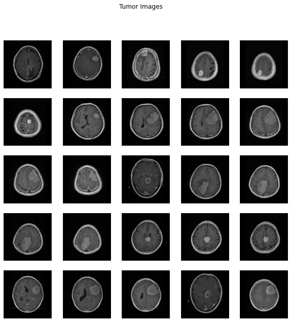
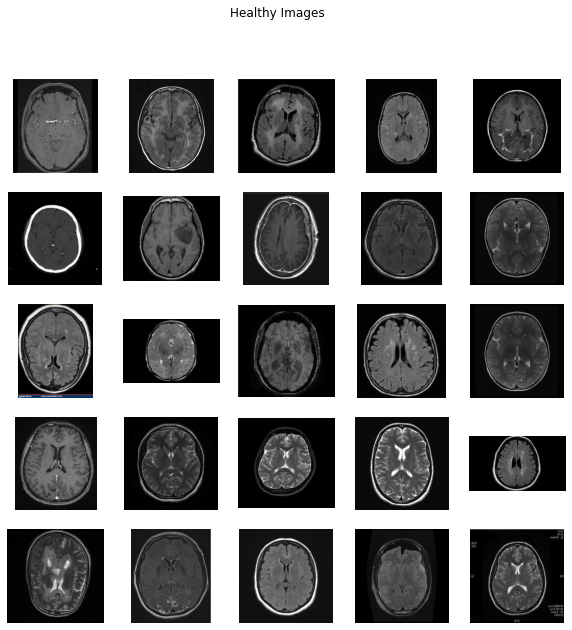

We use Conv net (CNN) here to detect cancer. dataset come from kaggle brain cancer. In this samplewe use keras tool to automatically create numpy array from image directory containing tumor and healthy directories.
 

 
